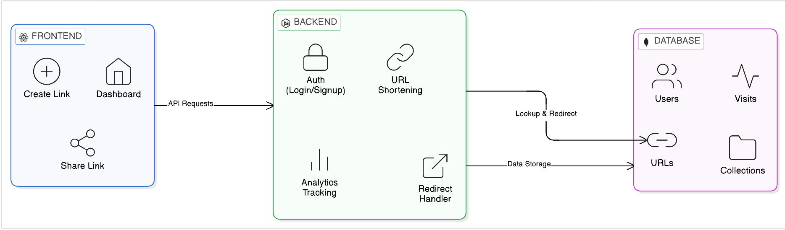

## Demo Video

Link: https://www.loom.com/share/595127c46d854bccb829640c9363d22b
Shortened-Link: http://localhost:5000/YmObIFPKOw

# Snip — Modern URL Shortener

Snip is a comprehensive link management and analytics platform designed to simplify how users shorten, organize, and track their digital footprint. Beyond basic URL shortening, it provides an intuitive suite of tools for campaign grouping and engagement monitoring.

---

## Features

- **Authentication**: Secure user signup and login with JWT-protected routes and password visibility control.
- **URL Shortening**: Rapid generation of unique short codes with URL validation and high-speed redirection.
- **Dashboard**: Centralized interface to view, copy, share, and delete shortened links.
- **Analytics**: Real-time tracking of click counts, last visited timestamps, and individual link visit history.
- **Collections/Campaigns**: Ability to group related links into collections to track aggregate performance across specific initiatives.
- **Share Functionality**: Integrated options to copy links to clipboard and share directly via WhatsApp or Email.
- **Clean UI/UX**: Professional dark-themed interface with glassmorphic elements and optimized user flows.

---

## Tech Stack

### Frontend
- React
- Vite
- Tailwind CSS
- Framer Motion

### Backend
- Node.js
- Express

### Database
- MongoDB

### Authentication
- JWT (JSON Web Tokens)

---

## Setup Instructions

### Prerequisites

- Node.js
- MongoDB (local or Atlas)

### Installation

#### Backend
```bash
cd server
npm install
npm run dev
```

#### Frontend
```bash
cd client
npm install
npm run dev
```

### Environment Variables

Create a .env file in the /server directory with the following variables:

```env
MONGODB_URI=your_mongodb_uri
JWT_SECRET=your_secret
PORT=5000
```

---

## Assumptions Made

- Users will manually share links through their preferred external platforms using the integrated sharing tools.
- Advanced geolocation analytics are not implemented; tracking is currently focused on click frequency and timestamps.
- Basic input validation is used for emails, URLs, and passwords.

---

## AI Planning Document

Document: https://docs.google.com/document/d/1xC9ddnlyjK7K6XAlItKzrbqaSybhxFqW/edit?usp=drive_link&ouid=112514496581419661168&rtpof=true&sd=true
Shortened-Link: http://localhost:5000/Lfk2_cXCiI

### Planning Approach
The project followed a modular development cycle: identifying core features → building a stable full-stack foundation → enhancing the user experience with optimistic updates and sophisticated UI patterns.

### Why Collections Were Added
Collections were implemented to move beyond flat link lists, allowing users to organize their digital assets by campaign or theme, mirroring real-world marketing workflows.

### Prioritization
Sharing and analytics were prioritized as the core value proposition of the product, ensuring users can both deploy links easily and measure their impact immediately.

---

## Architecture Diagram


---

##Sample Output
Link: https://docs.google.com/document/d/1LCegVQcUbNJfttsY5raXymtj37GTeLhx/edit?usp=sharing&ouid=112514496581419661168&rtpof=true&sd=true

## Future Improvements

- QR code generation for every shortened link.
- Advanced analytics including device, browser, and geographic distributions.
- Public statistics pages for individual links.
- Custom vanity aliases for branded short links.
---

## Note on Demo Links

The shortened links used in the demo video are generated from the local development environment (`localhost`). 

As a result, these links will only work while the backend server is running locally. If the server is not running, the shortened URLs will not redirect.

For demonstration purposes, please refer to the video to see the full functionality of link redirection and analytics in action.

This project is a part of a hackathon run by https://katomaran.com
